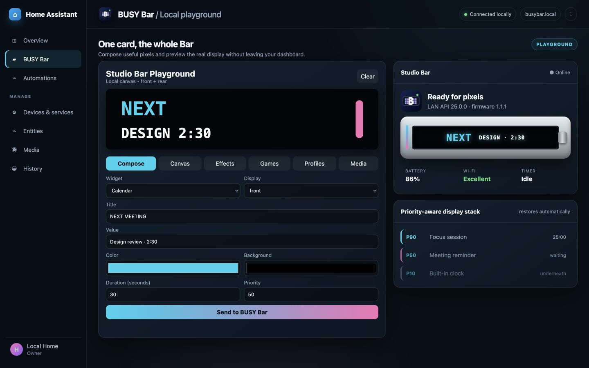
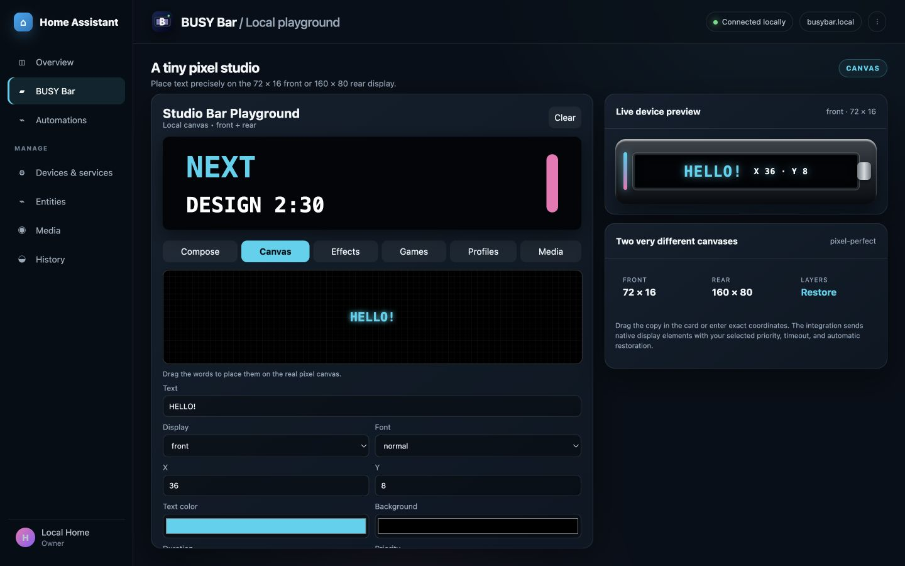
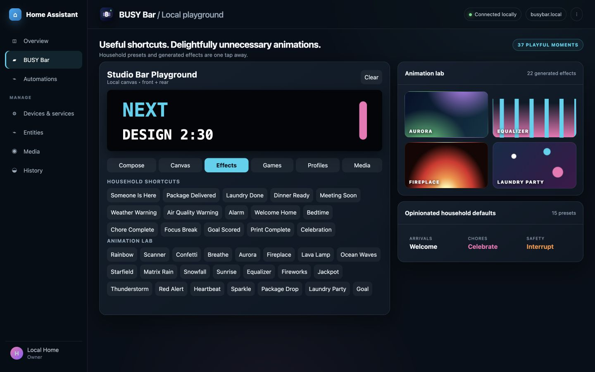
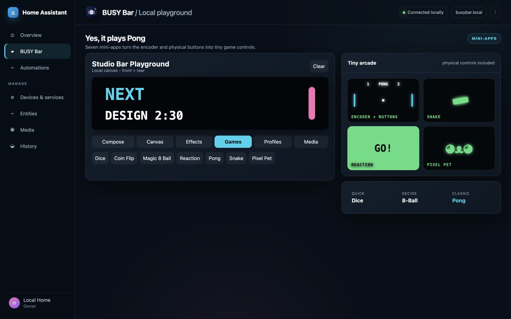
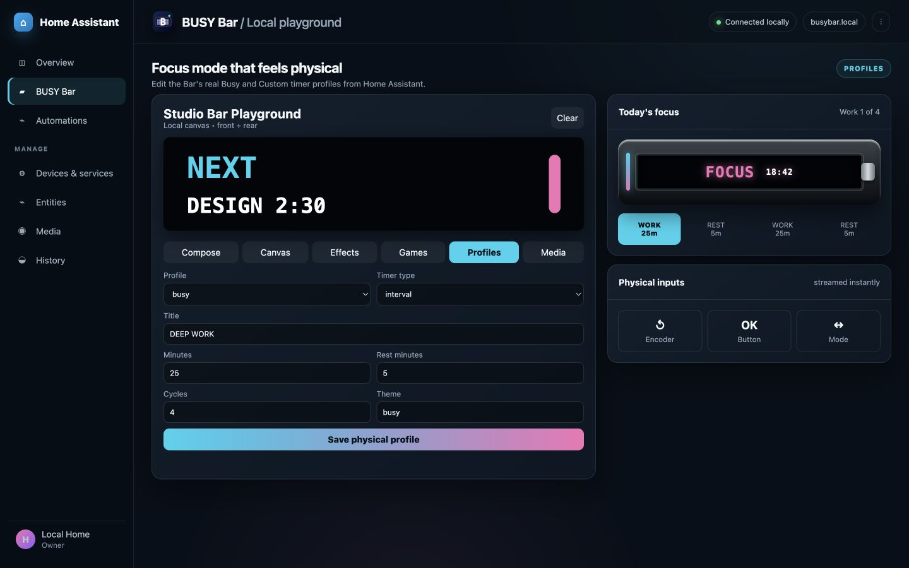
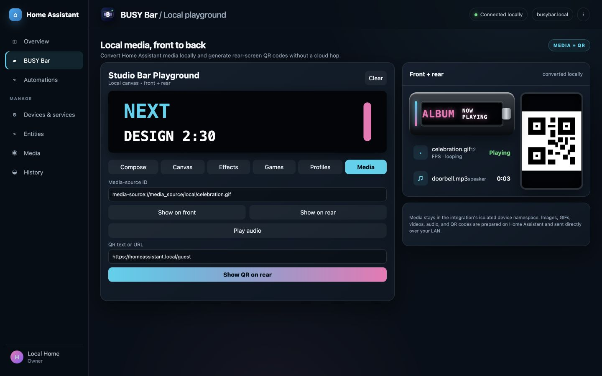
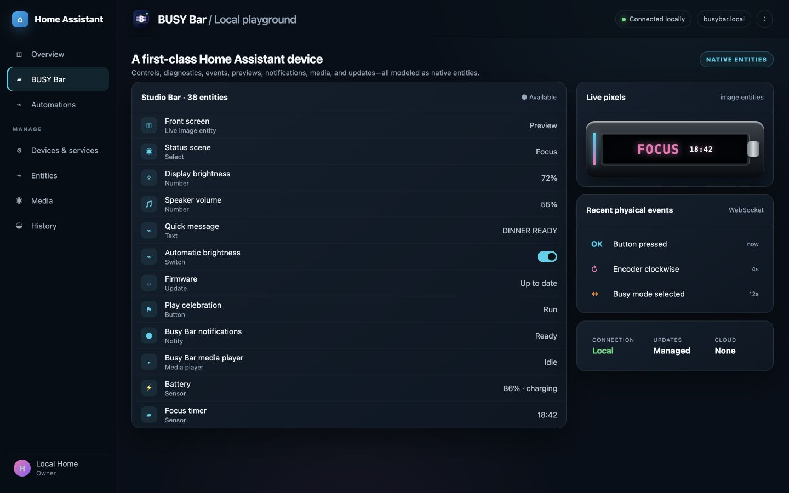
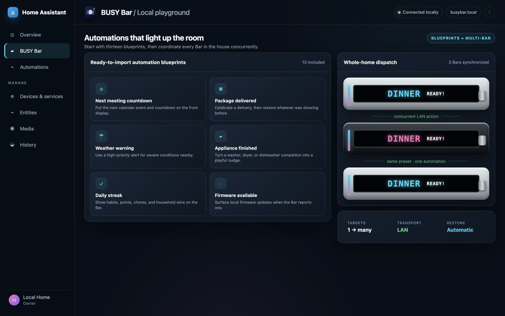

# BUSY Bar for Home Assistant

[](https://github.com/amcchord/home-assistant-busybar/releases)
[](https://github.com/amcchord/home-assistant-busybar/actions/workflows/validate.yml)
[](https://github.com/amcchord/home-assistant-busybar/actions/workflows/test.yml)
[](#installation)
[](LICENSE)

A local-first, unusually playful [BUSY Bar](https://busy.app) integration for [Home Assistant](https://www.home-assistant.io). It turns the Bar's displays, LED, speaker, timer, switch, encoder, and buttons into first-class Home Assistant building blocks—without putting a cloud service in the control path.

## See it in action

These staged dashboard captures use the real bundled Playground card and representative Home Assistant entities to show the integration's range.

<table>
  <tr>
    <td width="50%">
      
      <br><sub><strong>Compose and preview.</strong> Build widgets for either screen while watching the live front display.</sub>
    </td>
    <td width="50%">
      
      <br><sub><strong>Place every pixel.</strong> Drag text around the 72 × 16 front or 160 × 80 rear canvas.</sub>
    </td>
  </tr>
  <tr>
    <td width="50%">
      
      <br><sub><strong>Make status delightful.</strong> Start with 15 household presets or pick from 22 generated effects.</sub>
    </td>
    <td width="50%">
      
      <br><sub><strong>Turn it into a tiny arcade.</strong> Seven mini-apps include physical-control Pong, Snake, and Reaction.</sub>
    </td>
  </tr>
  <tr>
    <td width="50%">
      
      <br><sub><strong>Make focus physical.</strong> Edit the real Busy and Custom profiles and react to buttons, the encoder, or mode switch.</sub>
    </td>
    <td width="50%">
      
      <br><sub><strong>Keep media local.</strong> Send Media Source images, animation, audio, and locally generated rear-screen QR codes.</sub>
    </td>
  </tr>
  <tr>
    <td width="50%">
      
      <br><sub><strong>Use native building blocks.</strong> Controls, events, previews, notifications, media, updates, and diagnostics all feel at home.</sub>
    </td>
    <td width="50%">
      
      <br><sub><strong>Automate one Bar—or every Bar.</strong> Import 13 blueprints and dispatch concurrently across a room or home.</sub>
    </td>
  </tr>
</table>

## What it can do

- **React instantly.** Physical buttons, the encoder, mode switch, timer transitions, device state, and screen frames arrive over the local WebSocket. Polling remains as a resilient fallback.
- **Compose without display fights.** A priority-aware layer stack expires temporary content and restores what was underneath. Normal notifications stay below an active focus session unless you explicitly override it.
- **Feel native in Home Assistant.** Event, image, media-player, notify, update, switch, time, button, select, number, text, sensor, and binary-sensor entities are included, along with device automation triggers and Repairs.
- **Make the pixels useful.** Friendly widgets cover messages, entities, weather, calendar entries, clocks, countdowns, progress, charts, alerts, daily streaks, and household scoreboards on either display.
- **Make the pixels ridiculous.** There are 22 generated effects, 15 one-tap household presets, and seven mini-apps. Reaction, Pong, and Snake use the physical controls.
- **Use local media.** Convert images, GIFs, videos, and audio selected from Home Assistant Media Source; upload them only to this integration's isolated device namespace. Generate rear-screen QR codes locally.
- **Manage the device.** Edit both physical timer profiles, set brightness/volume, configure automatic updates and their time window, toggle Bluetooth and the smart-home switch, check/install firmware, and open smart-home pairing with its QR shown on the rear screen.
- **Coordinate a roomful of Bars.** Every action accepts one or more devices and dispatches to them concurrently.

Everyday operation is LAN-only. There is no BUSY account requirement, telemetry, or cloud fallback in this integration.

## Installation

### HACS

Until the project is listed in HACS defaults, add it as a custom repository:

1. Open **HACS → Integrations**.
2. Open the three-dot menu and choose **Custom repositories**.
3. Add `https://github.com/amcchord/home-assistant-busybar` as an **Integration**.
4. Install **BUSY Bar**, then restart Home Assistant.

[](https://my.home-assistant.io/redirect/hacs_repository/?owner=amcchord&repository=home-assistant-busybar&category=integration)

For a manual install, copy `custom_components/busybar` into the same directory under your Home Assistant configuration and restart.

## Setup

In the BUSY Bar's local web interface, open the HTTP API settings and enable Wi-Fi access:

- **On:** leave the API key blank in Home Assistant.
- **Key:** enter the 4–10 digit local API key during setup.
- **Off:** protected endpoints are unavailable; the Home Assistant setup flow explains how to enable them.

Then go to **Settings → Devices & services → Add integration**, search for **BUSY Bar**, and enter the local address. DHCP discovery may already have found it. Key mode is recommended on shared or untrusted LANs; the key stays in Home Assistant and is sent only to the Bar.

## Home Assistant surface

| Kind | Included |
| --- | --- |
| Sensors | Battery, Wi-Fi, power, timer state/remaining interval, Busy and Custom profiles, firmware/API, uptime, free storage |
| Binary sensors | Busy, timer paused, charging, update available |
| Event entities | OK, Back, Start, encoder, mode switch, timer lifecycle |
| Images | Live front-screen preview and on-demand rear-screen preview |
| Controls | Brightness, volume, status scene, quick message, auto brightness/update, update window, Bluetooth, smart-home switch |
| Buttons | Timer transport, celebration, display clear, update check/abort, smart-home pairing start/stop |
| Media and notifications | Native media player, native notify entity, legacy per-device notify service |
| Update | Firmware update entity with progress and release notes |

Physical events are also offered as visual device triggers, so automations can start with phrases such as “when the encoder turns clockwise” or “when the Busy switch position is selected.” Timer triggers distinguish started, paused, resumed, interval phase changed, finished, and manually stopped.

## BUSY Bar Playground card

The integration serves and registers its dashboard card automatically. Add a manual card to a dashboard:

```yaml
type: custom:busybar-card
device_id: YOUR_DEVICE_ID
preview_entity: image.your_busy_bar_front_screen
title: Studio Bar
```

The card includes:

- a widget composer for both screens;
- a draggable 72×16 / 160×80 pixel canvas;
- all household presets and generated effects;
- Dice, Coin Flip, Magic 8-Ball, Reaction, Pong, Snake, and Pixel Pet;
- a physical Busy/Custom profile editor;
- local Media Source image, animation, audio, and QR tools;
- the live screen preview.

See [the Playground guide](docs/playground-card.md) for controls and troubleshooting.

## Display ownership and priorities

| Priority | Intended use |
| ---: | --- |
| 10 | Ordinary built-in apps |
| 50 | This integration's safe default |
| 90 | Active BUSY or Custom work session |
| 100 | A deliberate emergency interruption |

Temporary Home Assistant layers wait behind higher-priority content, keep their remaining lifetime, and restore the next eligible layer when dismissed or expired. A firmware-level priority conflict becomes an actionable Home Assistant error. Change the default under the integration's **Configure** menu or override one action; use 91–100 sparingly.

## Actions and delightful defaults

Home Assistant exposes every action through the visual automation editor. Highlights include:

- `busybar.show_widget`, `show_message`, `show_progress`, and advanced `draw`;
- `busybar.play_preset`, `play_effect`, and `play_game`;
- `busybar.show_media`, `play_media`, `show_qr`, `play_sound`, and `stop_sound`;
- `busybar.start_focus`, `set_profile`, and `send_key`;
- `busybar.check_update`, `abort_update`, `clear_display`, and `delete_assets`.

Try an opinionated default:

```yaml
action: busybar.play_preset
data:
  device_id:
    - YOUR_DEVICE_ID
  preset: laundry_done
  message: TOWELS ARE READY
```

Or show a widget that restores the prior display after 30 seconds:

```yaml
action: busybar.show_widget
data:
  device_id: YOUR_DEVICE_ID
  widget: progress
  title: 3D PRINT
  value: 68%
  progress: 68
  color: [56, 189, 248]
  duration: 30
  restore: true
```

`busybar.draw` accepts the official API's `DisplayElements` body minus `application_name`; the integration supplies its isolated `home_assistant` ownership name. See the [BUSY Bar API reference](https://api.busy.app/busybar/docs) for the raw element schema.

## Blueprints

Thirteen ready-to-import blueprints live under `blueprints/automation/busybar`:

- next meeting countdown;
- appliance finished;
- progress mirror;
- physical focus-mode scene;
- doorbell alert;
- firmware update available;
- person arrived;
- weather warning;
- air-quality warning;
- bedtime wind-down;
- package delivered;
- daily streak or points display;
- critical safety alarm.

See [automation recipes](docs/automations.md) for YAML examples, event payloads, multi-Bar use, and priority guidance.

## Compatibility

- Home Assistant 2025.12 or newer.
- HACS 2.x.
- BUSY Bar firmware with the local HTTP API. Hardware development and validation use firmware **1.1.1** with API **25.0.0**.
- [`busylib`](https://github.com/busy-app/busylib-py) 1.3.0, pinned and tested in CI.
- Local media conversion requires the same FFmpeg support Home Assistant uses for media workflows.

Features unavailable on older firmware fail gracefully where practical. The integration never initiates firmware installation unless you explicitly press Install on the update entity.

## Privacy, safety, and diagnostics

Normal traffic stays between Home Assistant and the configured LAN address. Media is capped at 20 MB, converted locally, and stored under the integration's device namespace; cleanup does not touch assets owned by other apps. Animations are capped at 12 FPS and 30 seconds. QR generation is local and density-checked for the rear OLED.

Diagnostics redact the API key, configured host, network names/addresses, serial number, and MAC addresses. Repairs identify low storage, battery-blocked updates, failed updates, and repeated WebSocket disconnects.

Read [SECURITY.md](SECURITY.md) before reporting a vulnerability.

## Development

```bash
python -m venv .venv
source .venv/bin/activate
pip install -r requirements_test.txt
pytest
ruff check .
ruff format --check .
deno check custom_components/busybar/www/busybar-card.js
```

CI also runs HACS validation and hassfest. The test suite validates every scene, effect, preset, widget on both screens, stream event decoding, display restoration, media generation, bundled blueprint, config flow, entity setup, translations, and manifest contracts.

Contributions and delightfully unnecessary pixel animations are welcome—see [CONTRIBUTING.md](CONTRIBUTING.md).

## Acknowledgements

This independent community integration is not affiliated with or endorsed by BUSY. BUSY Bar and related marks belong to their respective owner. It is built on BUSY's documented local API and official open-source Python client.
