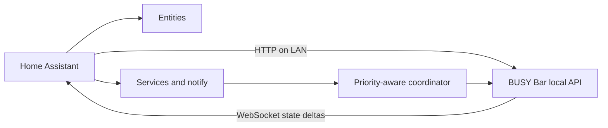

# Architecture

The integration deliberately keeps the cloud out of the control path.

## State

The coordinator uses the official asynchronous `busylib` client. A broad snapshot is collected every 15 seconds by default. The `/api/status/ws` stream applies power, Wi-Fi, brightness, volume, update, BLE, name, and frame deltas between polls. Timer deltas trigger a focused refresh.

The snapshot collector is deliberately tolerant of optional endpoint failures, while the protected `/api/status` call is the availability and authentication boundary.

## Commands

All display writes use the application name `home_assistant`. Clearing the display therefore removes only this integration's elements. A per-device lock serializes draw requests, and a new static command cancels any in-flight animation.

Generated animations are bounded by duration (0.5–30 seconds) and frame rate (2–12 FPS). They are sequences of regular DisplayElements requests and require no uploaded assets.

## Priorities

The firmware accepts a draw when its priority is greater than or equal to the active app's priority. The integration defaults to 50: above ordinary built-in apps (10), below an active BUSY session (90). HTTP 409 becomes an actionable Home Assistant error rather than a silent failure.

## Identity and discovery

The device serial number is the config-entry unique ID. The device registry also records the Wi-Fi MAC address. DHCP discovery uses BUSY's `0C:FA:22` OUI. The manifest and config flow support `_busybar._tcp.local.` for firmware that advertises it; current shipping firmware may not yet do so.

## Secrets

The optional local API key lives in `ConfigEntry.data`. It is masked by `busylib` logs and redacted from diagnostics along with network and hardware identifiers.

