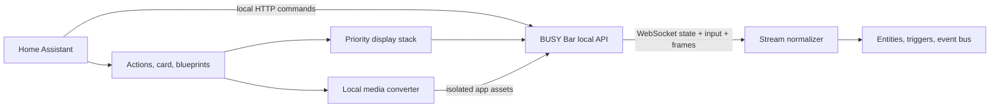

# Architecture

The integration keeps cloud services out of the runtime control path and gives Home Assistant-owned display content explicit lifecycle semantics.

## State and events

The coordinator uses the official asynchronous `busylib` client. A broad snapshot is collected every 15 seconds by default. The local `/api/status/ws` stream applies power, Wi-Fi, brightness, volume, update, Bluetooth, device-name, and screen-frame deltas between polls.

The stream normalizer turns firmware messages into a stable internal event model:

- button press and release for OK, Back, and Start;
- clockwise/counterclockwise encoder turns with delta;
- Busy, Custom, Off, Apps, and Settings switch positions;
- timer started, paused, resumed, phase changed, finished, and stopped.

These events feed event entities, Home Assistant device triggers, the `busybar_event` bus event, and interactive mini-apps. Protobuf zero-valued enums and compressed timer envelopes are handled explicitly. Malformed envelopes are ignored at the trust boundary rather than taking down the stream.

## Display compositor

Every friendly draw becomes a Home Assistant-owned layer with a priority, sequence number, optional stable ID, and optional expiry. The highest-priority newest eligible layer is rendered. Lower layers stay queued. When a layer expires or is dismissed, the compositor redraws the next eligible layer with a corrected remaining timeout.

All physical writes are serialized. Drawing uses `application_name: home_assistant` and clearing targets only that application name. This prevents cleanup from deleting a built-in app's elements.

Effects and games update one stable layer instead of creating a new layer per frame. They are bounded by runtime and frame rate. Starting static content cancels an active animation/game cleanly, and shutdown cancels tasks without unexpectedly clearing the physical display.

## Media ownership

Media actions resolve only through Home Assistant Media Source. Inputs are capped at 20 MB, converted off the event loop through `busylib`, then uploaded into the `home_assistant` namespace. An in-memory SHA-256 cache avoids re-uploading identical content during a coordinator lifetime. Cleanup calls the namespace-scoped delete endpoint.

QR codes are generated locally, checked against the 160×80 rear display, converted to PNG, and uploaded through the same path. Remote arbitrary URLs are not accepted as media inputs.

## Native Home Assistant model

The integration exposes state through coordinator entities and commands through native domains wherever the model fits:

- physical input through Event entities and device triggers;
- screen frames through Image entities;
- speaker playback through Media Player;
- display delivery through Notify;
- firmware through Update;
- toggle/configuration settings through Switch and Time;
- diagnostics and user-fixable health conditions through Diagnostics and Repairs.

The legacy per-device notify service remains for existing automations, while the native Notify entity is the preferred new interface.

## Multi-device dispatch

All custom actions accept a list of device IDs. Device targets are resolved to coordinators and dispatched concurrently with `asyncio.gather`, which keeps synchronized effects and room-wide messages visually close without coupling device availability or sharing state between config entries.

## Identity, discovery, and secrets

The hardware serial number is the config-entry unique ID. The device registry also records the Wi-Fi MAC address. DHCP discovery recognizes BUSY's `0C:FA:22` OUI; zeroconf support is ready for firmware advertising `_busybar._tcp.local.`.

The optional local API key lives in `ConfigEntry.data`. It is masked by `busylib` logging and redacted from diagnostics along with network and hardware identifiers. Protected `/api/status` is the setup and reauthentication boundary.
